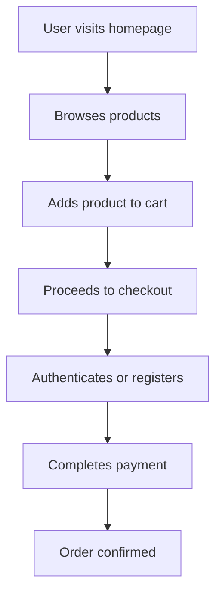

# GKart

GKart is a modern, scalable e-commerce platform that enables users to browse, purchase, and manage products online. Designed with flexibility and extensibility in mind, GKart provides a robust backend, an intuitive frontend, and essential features for a seamless online shopping experience.

## Introduction

GKart offers a complete online shopping solution that includes product listing, user authentication, order management, and payment processing. The platform aims to help businesses quickly set up and customize their own e-commerce stores with minimal technical overhead.

## Features

- User registration, login, and authentication
- Product catalog with categories and detailed product pages
- Shopping cart and checkout flow
- Order management for users and admins
- Integrated payment gateway support
- Admin dashboard for managing products and orders
- Responsive frontend design for mobile and desktop
- RESTful API for integration and extensions

## Requirements

Before installing GKart, make sure your environment meets the following prerequisites:

- Node.js (version 14.x or above)
- npm or yarn
- MongoDB or supported database
- Git (for cloning the repository)
- A modern web browser for accessing the frontend

## Installation

Follow these steps to install GKart on your system:

1. Clone the repository:
   ```bash
   git clone https://github.com/gnaneshwar86/GKart.git
   cd GKart
   ```

2. Install backend dependencies:
   ```bash
   cd backend
   npm install
   ```
   
3. Install frontend dependencies:
   ```bash
   cd ../frontend
   npm install
   ```

4. Set up your database (e.g., start MongoDB).

5. Configure environment variables for backend and frontend (see the Configuration section).

6. Start the backend server:
   ```bash
   npm start
   ```

7. Start the frontend development server:
   ```bash
   npm start
   ```

8. Access the application via your browser at the provided local address.

## Usage

Once GKart is running, you can:

- Register or log in as a user.
- Browse the product catalog and add items to your cart.
- Complete the checkout process using integrated payment options.
- View your order history and manage your account.
- If you are an admin, access the admin dashboard to add or update products and manage orders.

### Basic Flow



## Configuration

Customization and environment configuration are handled via environment variables.

### Backend

Create a `.env` file in the `backend` directory:

```env
PORT=5000
DB_URI=mongodb://localhost:27017/gkart
JWT_SECRET=your_jwt_secret
PAYMENT_GATEWAY_KEY=your_payment_key
```

### Frontend

Create a `.env` file in the `frontend` directory:

```env
REACT_APP_API_URL=http://localhost:5000/api
REACT_APP_PAYMENT_GATEWAY_KEY=your_payment_key
```

Adjust these settings for production deployments and review security best practices.

## Contributing

We welcome contributions to GKart! To get started:

- Fork the repository and create a new branch for your feature or bugfix.
- Follow established code style guidelines.
- Add appropriate tests for new features or bug fixes.
- Submit a pull request with a clear description of your changes.

### Contribution Guidelines

- Ensure all tests pass before submitting a PR.
- Document any new endpoints or configuration options.
- Use descriptive commit messages.

---

Thank you for considering GKart for your e-commerce needs! For issues or feature requests, please use the GitHub Issues system.
